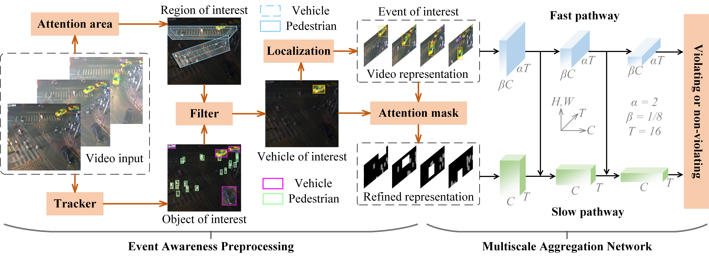
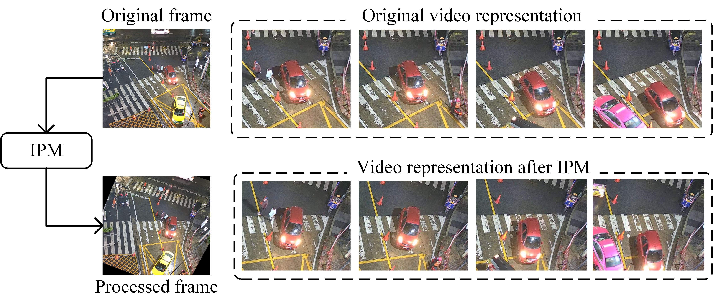
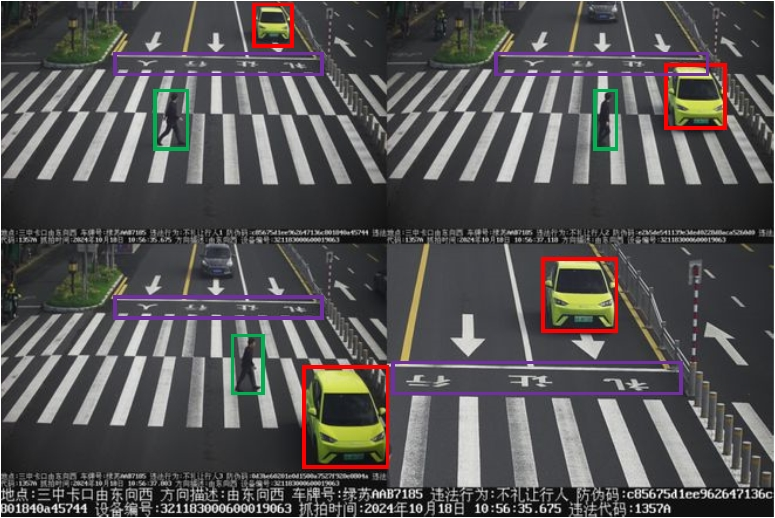
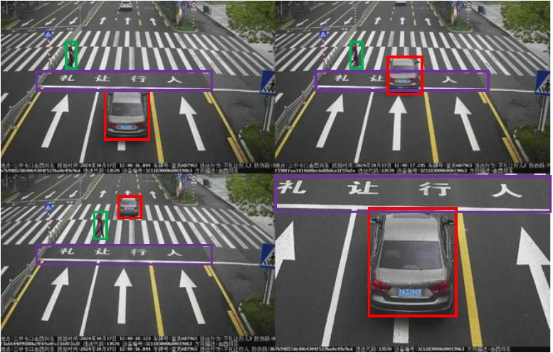
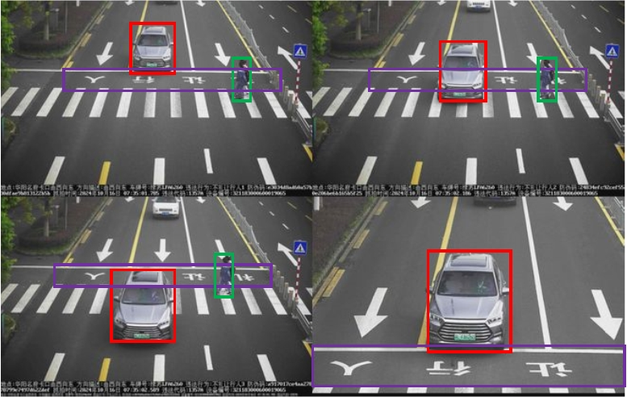

<div align="center">
  
  ***A glimpse into our Crosswalk dataset.***
  *It captures events involving multiple participants engaging in simultaneous interactions, highlighting diverse temporal patterns and behavioral dynamics.
  It features two distinct crosswalk areas, enabling a comprehensive analysis of pedestrian-vehicle interactions in real-world traffic conditions.*
  
</div>

<div align="center">

# The Crosswalk Dataset

This is the dataset and code for manuscript

**Crosswalk: A Traffic Monitoring Dataset for Vehicle Non-Yielding Violations Detection   
and Interactive Scenarios Understanding**. ([*TITS 2025*](https://ieeexplore.ieee.org/document/10991963))

✨ *A modest and well-mannered human, as warm and soothing as jade.* ✨

🌟 *It is a mark of grace for vehicles to yield with courtesy,   
just as it is for pedestrians to express their gratitude with warmth.* 🌟

😊 *Take a peek at this delightful [video](https://www.bilibili.com/video/BV1yxzMYvEAR/?spm_id_from=333.999.0.0&vd_source=eddbddd586274419b16d008f523949ef) (48 seconds) !* 😊

</div>

# Overview

- We introduce a novel traffic monitoring dataset, *Crosswalk*, which not only encompasses integrated pedestrian and vehicle interactions but also specifically detects instances where vehicles fail to yield to pedestrians.

- We propose a effective analytical framework to comprehend pedestrian-vehicle dynamics, facilitating the detection of specific violation incidents.



<div align="center">
  
  ***Overview of the violation detection process, organized into two stages.***
  *In the first stage, a tracker identifies vehicles of interest by detecting bounding box intersections within a predefined region, enabling the localization of event boundaries.
   In the second stage, an attention mask is applied to the relevant video segments, which are then processed by a two-pathway model to classify the presence of a violation.*

</div>

# Update Notification

- *Sep 3, 2025*

&nbsp;&nbsp;&nbsp;&nbsp; All videos of the Crosswalk dataset are now available for download via [Figshare](#dataset-download).

- *Apr 21, 2025*

&nbsp;&nbsp;&nbsp;&nbsp; Our paper has been accepted by *IEEE Transactions on Intelligent Transportation Systems* (**TITS**).

- *Dec 13, 2024*

&nbsp;&nbsp;&nbsp;&nbsp; You can download the model [parameters](#training-and-testing) to reproduce.

- *Dec 9, 2024*

&nbsp;&nbsp;&nbsp;&nbsp; The current versions are **all available** for download from **Baidu Disk**.

&nbsp;&nbsp;&nbsp;&nbsp; Some important data is already available for download from **Google Drive**.

# Crosswalk

## Dataset License and Usage Statement

This dataset is released for *educational purposes only*. By downloading or using this dataset, you agree to the following terms:

*Non-Commercial Use Only:*
The dataset must not be used for commercial purposes or any commercial gain.

*Attribution Required:*
Any publications or projects using this dataset must cite the original source as specified in the accompanying documentation.

*No Redistribution:*
Redistribution of the dataset, in whole or in part, is strictly prohibited. Please refer interested users to the official release source.

*No Warranty:*
The dataset is provided "as is" without any warranties, express or implied. The authors and affiliated institutions are not liable for any damages or consequences arising from the use of this dataset.

*Ethical Use:*
Users must use this dataset in accordance with applicable laws and ethical research guidelines. It must not be used in any way that could cause harm or violate the rights of individuals.

*Governing Institution and Legal Responsibility:*
The School of Computer and Electronic Information / School of Artificial Intelligence, Nanjing Normal University, reserves the final right of interpretation of this dataset and its license.
Any individual or organization found in violation of the above terms may be subject to legal action and liability as deemed appropriate by the institution.

## Dataset Introduction

 This dataset originates from continuous 24-hour live-streams of a specific intersection in Bangkok, captured from a fixed overhead perspective on [YouTube](https://www.youtube.com/watch?v=xbBKbDwlR0E).
 
 It consists of 10 hours of footage, divided into **120** untrimmed videos, recorded between November 2023 and May 2024.
 
 Video numbers range from **video_001.avi** to **video_120.avi**. All videos are **five minutes** long.
 
 These videos feature the same traffic scene under various weather conditions and times of day.
 
 Focusing on **two** crosswalks, the dataset captures vehicles moving bidirectionally, entering and exiting the frame via the left and right boundaries.
 
 To reduce extraneous background activity, the recordings were confined to areas of interest, yielding a final video resolution of 1200×1100 pixels at 30 fps.

## Dataset Download

 Now you can reproduce our method in two ways:

 - Download the full dataset and continue. You can download the data through [Baidu Disk](https://pan.baidu.com/s/1OrlSCXYRVd35eXw2Pry8nA?pwd=985x).

 - You can also download the Crosswalk dataset via Figshare.
Due to upload size limitations, we split the dataset into three parts, each containing 40 videos.
This means you will need to download all three parts separately:

&nbsp;&nbsp;&nbsp;&nbsp; Part 1: **video_001.avi~video_040.avi** &nbsp;&nbsp; [Download](https://figshare.com/articles/dataset/video_001_avi_video_040_avi/29983897)

&nbsp;&nbsp;&nbsp;&nbsp; Part 2: **video_041.avi~video_080.avi** &nbsp;&nbsp; [Download](https://figshare.com/articles/dataset/video_041_avi_video_080_avi/30050131)

&nbsp;&nbsp;&nbsp;&nbsp; Part 3: **video_081.avi~video_120.avi** &nbsp;&nbsp; [Download](https://figshare.com/articles/dataset/video_081_avi_video_120_avi/30051331)

 - You can **directly download our preprocessed data for reproduction**.

 - Since upgrading Google Drive storage requires additional fees, which are currently beyond our budget, we are unable to share the full Crosswalk dataset via Google Drive at this time. We sincerely apologize for any inconvenience.

If researchers are still interested in obtaining the dataset through Google Drive, we kindly ask that:

&nbsp;&nbsp;&nbsp;&nbsp; *You provide a Google account with more than 50GB of available storage (along with temporary access credentials). We will upload the dataset to this account, after which you are free to change the password.*

&nbsp;&nbsp;&nbsp;&nbsp; *You agree to keep sharing the Crosswalk dataset as a public resource for the community.*

Our goal is to leverage community efforts to provide a more convenient way for everyone to access the dataset. Beyond this approach, we currently have no plans to host the entire dataset on our own Google Drive. We appreciate your understanding and support.

## Dataset Annotations

You can download the violation event annotations through [Baidu Disk](https://pan.baidu.com/s/1aoJLJUT-A7H4jO1Luzsp9w?pwd=6l8r) or [Google Drive](https://drive.google.com/file/d/1pKrevRdrWC7-hDcp8O-jYVJMv-YMPayW/view?usp=sharing).

We define **an interaction event** as **the period during which a vehicle enters or exits the crosswalk area concurrent with a (or several) pedestrian's presence**.

As a result, we have meticulously annotated approximately **7.7k** pedestrian-vehicle interaction events.

The *Crosswalk* dataset comprises two categories of pedestrian-vehicle interaction events: violations and non-violations, totaling 1972 and 5752 events, respectively.

In this work, **event-level** annotations are used as they effectively reflect the instance situation.

The annotations are stored in JSON files, generated using **Labelme**, where the file names correspond to the frame numbers at which the events occur. 

Each JSON file contains two key data, namely **class**, **points** and **group_id**.

- **class** indicates whether a vehicle violates the rule of giving way to pedestrians during the event.
  
  **class** is **0 for violation** and **1 for non-violation**.

- The bounding box coordinates are recorded under **points**, capturing the **key vehicle's location as it enters and exits the crosswalk**.

  The bounding box coordinates of the vehicle in the form of **(top left x, top left y, bottom right x, bottom right y)**.

- **group_id** uniquely identifies the event number for pedestrian-vehicle interactions at the crosswalk, distinguishing it from other events.

  If a vehicle passes through two crosswalks with pedestrians present, it corresponds to two distinct events.

  Each event will be associated with a unique pair of group_ids, representing the annotations for the respective events.

For instance, if a vehicle enters the area of interest at frame **1301** and leaves at frame **1501**, and fails to yield to pedestrians during this time, two JSON files will be created: **00001300.json** and **00001500.json**. Meanwhile, Both json files have the same **group_id** and **class (0)**.

*Convert event annotations in json format to txt text. Run:*

`python json_to_txt.py`

It is recommended to put these files in a folder as follows, and you can also **modify the path**.

        -annotations\
          -video_001\
            -00000291.json
            -00000377.json
            ...
          -video_002
          ...
          -video_120
        -json_to_txt.py

For a certain event of a certain vehicle 𝒱, the format of the txt file is:

        -group_id
        -2
        -1 / The frame number in which 𝒱 enters the crosswalk / 0 / The bounding box when 𝒱 enters the crosswalk
        -2 / The frame number in which 𝒱 leaves the crosswalk / 0 / The bounding box when 𝒱 leaves the crosswalk

## Evaluation Criteria


<div align="center">
  
  ***Illustration of the cross-validation benchmark configurations, incorporating both cross-view and cross-scene settings to comprehensively assess model robustness from temporal and spatial perspectives.***

</div>


To evaluate the model's generalization and robustness, we designed two distinct cross-validation benchmarks: **cross-video** and **cross-scene**.

- **Cross-video evaluation.** We sequentially numbered 120 video segments, with snippets from odd-numbered videos used for training and even-numbered for testing. This method evaluates the model's ability to generalize across diverse video sequences.

- **Cross-scene evaluation.** Under this benchmark, events from the upper crosswalk area were assigned to the training dataset, while events from the lower area were allocated to testing. This approach assesses the model's capability to recognize violations across varied traffic scenarios.

## Dataset Preparation

We divide the video into frames, which is also an important pre-step for subsequent preprocessing.

*Take video_001.avi as an example and divide it into frames:*

`pip install video-cli`

`video-toimg video_001.avi`

# Event Awareness Method

The overall steps include:
**Tracking** → **Filtering** → **Localization**

**To demonstrate the output at each step, we have prepared separate Python files corresponding to nearly every stage of the process.** 

You can *follow them sequentially* or *download our preprocessed files* for quick reproduction.

## Tracking

### Pretrained Detector

To accurately detect objects of interest in traffic scenes, we use **YOLOv8** for pre-training on additional annotated datasets.

We recommend using the provided [dataset](https://app.roboflow.com/nnu-hi7if/nnu_intersection/7) for object detector training or utilizing the trained model parameters.

Please install the environment according to the official website of [Ultralytics YOLOv8](https://github.com/ultralytics/ultralytics/blob/main/README.md).

All models were trained on an RTX 4090. You can use our **pretrained weights** or train the model yourself.

You can download the weights through [Baidu Disk](https://pan.baidu.com/s/1XhjA8IiR8zNuU3blHsymEQ?pwd=z8fl) or [Google Drive](https://drive.google.com/drive/folders/1fPra_scgzv_RP1yKMQ83HdyWiVFyeYkc?usp=sharing).

*It is recommended to train the detector based on the pre-trained parameters:*

`yolo task=detect mode=train model=yolov8m.pt data=intersection_images/data.yaml epochs=100 imgsz=640`

YOLOv8 has five variants: -n, -s, -m, -l, -x. The "model" parameter can be modified to specify the variant to use.

We recommend using **-m** as it achieves better results on the auxiliary dataset.

### Tracking pedestrians and vehicles

You can **skip this step** by downloading the **tracking data** (430MB) we preprocessed earlier.

You can download the tracking data through [Baidu Disk](https://pan.baidu.com/s/1niuto7cPNf1DqRzpr8h0LQ?pwd=teou) or [Google Drive](https://drive.google.com/file/d/1rwJ9bXvbW7czSOqD_2WHxHweK7PadzZF/view?usp=sharing).

Make sure you have **downloaded the dataset and pretrained weights**.

In addition, the **[operating environment](#pretrained-detector)** of YOLOv8 also needs to be configured.

It is recommended to **put these files in a folder as follows**, and you can also **modify the path**.

        -intersection-video\      # The Crosswalk dataset
          -video_001.avi  
          -video_002.avi
          ...
          -video_120.avi
        -detector_weight\         # The detector weight
          -m\          
            -weights\
              -best.pt
        -tracking.py

*Next, the tracker is called to sequentially process the video:*

`python tracking.py`

The program takes several hours to run completely. You will get the following in the same file:

        -tracking.py
        -tracking_output\  
          -video_001.txt  
          -video_002.txt
          ...
          -video_120.txt

These txt files contain the raw tracking data.

## Filtering

*Filter the original trajectory to identify the vehicle IDs of interest:*

`python filtering_1.py`

You can **skip this step** by downloading the **data** (62MB) we preprocessed earlier.

You can download the data through [Baidu Disk](https://pan.baidu.com/s/1NY9l_OWqlPoGjJXLiPhoCQ?pwd=lq1p) or [Google Drive](https://drive.google.com/file/d/1dbJPFLjdewRFxvqY_KOMwKh-FoD4wBnn/view?usp=sharing).

## Localization

*Next, use the vehicle IDs identified in the previous stage, determine the time when each vehicle enters and exits the crosswalk:*

`python filtering_2.py`

You can **skip this step** by downloading the **data** (65MB) we preprocessed earlier.

You can download the data through [Baidu Disk](https://pan.baidu.com/s/1ANqBnCyIplW-DCj-e2f9gw?pwd=pit3) or [Google Drive](https://drive.google.com/file/d/1rBsdkhpgCxxTE-xbToJRY7jkWnFSdUND/view?usp=sharing).

*Then, generate the detection value in txt format:*

`python filtering_3.py`

Assume that the key vehicle in the detected event is 𝒱𝒹, its format is similar to the ground truth:

        -track_id
        -2
        -1 / The frame number in which 𝒱𝒹 enters the crosswalk / 0 / The bounding box when 𝒱𝒹 enters the crosswalk
        -2 / The frame number in which 𝒱𝒹 leaves the crosswalk / 0 / The bounding box when 𝒱𝒹 leaves the crosswalk

You can **skip this step** by downloading the **data** (610KB) we preprocessed earlier.

You can download the data through [Baidu Disk](https://pan.baidu.com/s/1pSkRGPJDVL0-rX19NRC33A?pwd=n0lk) or [Google Drive](https://drive.google.com/file/d/1JCwaziKEMoWawvzuc8Oy2M0VPM7wy9OX/view?usp=sharing).

# MAN

## Feature Extraction

For the pedestrian-vehicle interaction events of interest, we construct **two** types of representations:

**video representation (VR)** and **refined representation (RR)**.

<hr style="width:20%;text-align:center;margin-left:auto;margin-right:auto;">

 <p align="center">
  
  &nbsp;&nbsp;&nbsp;&nbsp;
  
</p>
 <p align="center">
  <em><strong>Feature visualization.</strong> Left: Video representation. Right: Refined representation.</em>
</p> 

<hr style="width:20%;text-align:center;margin-left:auto;margin-right:auto;">

### VR Generation

*Construct the video representation from the original video:*

`python preprocessing_vr.py`

You can **skip this step** by downloading the [VR features](https://pan.baidu.com/s/1JVXRf5kXREh3a1REQBJwUQ?pwd=m4r4) (11.9GB)

### RR Generation

Generate refined representations based on raw video and tracking data.

***First**, generate grayscale images that are consistent with the length and width of the original video frame and retain the position of pedestrians:*

`python background_removal_att.py`

You can **skip this step** by downloading the **data** (3GB) ([Baidu Disk](https://pan.baidu.com/s/1KOMPo5z3BxNEmknNRjhccg?pwd=h0a1) or [Google Drive](https://drive.google.com/file/d/1XtTEBXPn_PMUlBVZx58V1vZ59Or9xaFD/view?usp=sharing)) we preprocessed earlier.

***Then**, according to the key vehicle of each event, its position is represented in the grayscale sequence with a brightness different from that of pedestrians.*

`python preprocessing_rr.py`

You can **skip this step** by downloading the **refined features** (410MB) ([Baidu Disk](https://pan.baidu.com/s/13Dpw9sfgvsDdlwnGUtXGgw?pwd=1esm) or [Google Drive](https://drive.google.com/file/d/1gZCSWD1AC2dtdrcC1bP3U5KqjTvPZ1sX/view?usp=sharing)) we preprocessed earlier.

## Label Generation

The generated snippets consist of 32 downsampled images, named using the format **V**xxx**I**xxxxx**S**x**D**x**R**x**A**x (where x represents a number).

Let's take **V001I00002S1D0R0A1** as an example to explain the naming convention:

- **V** indicates the video number. For example, **V001** refers to video_001.
- **I** denotes the tracking ID of the key vehicle in each event. Here, **I00002** means that the vehicle's tracking ID is 2.
- **S** stands for the scene number. **S1** represents the lower crosswalk area, while **S0** indicates the upper crosswalk area.
- **D** specifies the vehicle's direction, indicating whether it is moving up or down, i.e., driving on the left or right side of the lane. In Thailand, vehicles typically drive on the left; **D0** represents down (right), and **D1** represents up (left).
- **R** shows whether data augmentation was applied. In this case, all samples are **R0**, indicating no data enhancement.
- **A** indicates whether the event is legal or illegal. **A0** denotes a violation, while **A1** indicates compliance.

## Training and Testing

After completing the preprocessing, the main program can be called for training and testing.

It is recommended to **put these files in a folder as follows**, and you can also **modify the path**.

        -main.py
        -dataset_reader_man.py      # Load the preprocessed data.
        -model_man.py               # Call the model and give it arguments
        -model                      # Modelzoo
        -label                      # Label file

        -tra_att_volumes_region     # RR
        -rgb_volumes_region         # VR
        ...

*When training an MAN from scratch, run:*

`python main.py`

You can use the model we have trained for testing.

The [model](https://pan.baidu.com/s/1S_qpnTAsqfm40hus6ERnOQ?pwd=pn8w) is specially for **cross-scene** evaluation.

The [model](https://pan.baidu.com/s/1a-DvLZTz61OxcMEjaFUYBA?pwd=q3n9) is specially for **cross-video** evaluation.

Please **calculate AP** after predicting the illegal/non-violation scores. Please refer to the next step for specific operations.

You can also modify the parameters to call other models for training and testing.

## EIoU and AP

For each event, we get two scores (violation and non-violation) during the test phase.

For MAN, we take the category corresponding to the maximum score.

For other models, we adopt the strategy of late fusion, and the scores of RR and VR are respectively input into the network for weighted fusion.

On this basis, we calculate **AP** based on the **EIoU** of each detected event and the ground truth.

In this work, **the threshold of EIoU** is set to **0.5**. 

That is, for each real event, **the EIoU of the detected event must be greater than the threshold** and **the predicted category must be correct** to be judged as **a successful detection**.

Each annotated event can **only be retrieved once**.

Therefore, for the predicted score, calculating AP requires **two** steps.

*The **first** step is to calculate the EIoU between the detected event and the ground truth:*

`python eiou_cal.py`

*The **second** step is to calculate AP based on the EIoU and whether the predicted category is accurate:*

`python ap_cal.py`

*Calculate the AP after score fusion:*

`python ap_cal_fushion.py`

# Discussion

## Coordinate Correction

In the Crosswalk dataset, pedestrians and vehicles share a unified coordinate system. Due to the fixed surveillance camera angle, the dataset includes two zebra crossing regions: the upper crossing, which is nearly horizontal, and the lower crossing, which appears slightly tilted.

This difference introduces a unique generalization challenge—whether models trained on interactions in the horizontal region can effectively generalize to those occurring in the tilted region.

Despite our efforts, we were unable to identify a suitable strategy for coordinate correction. We explored inverse perspective mapping (IPM) as a potential method to correct the tilted zebra crossing region, aiming to achieve a more consistent view.

Specifically, we processed each video frame individually, transforming the lower zebra crossing to resemble the horizontal perspective of the upper crossing.



<div align="center">
  
  ***Illustration of the inverse perspective mapping (IPM) process.***
  *After applying IPM to the original frames, the inclined lower region is transformed into a horizontal region, and these processed frames are subsequently used to construct video representations (VR).*

</div>

Experiments with SlowFast as the backbone network showed that models trained on corrected video representations performed worse than those trained on original frames. We hypothesize that the transformation-induced distortions negatively impacted feature extraction.

<div align="center">

<table>
  <caption>Detection performance of the proposed framework under different video representation inputs.</caption>
  <thead>
    <tr>
      <th rowspan="2">Input</th>
      <th colspan="3">Cross-scene</th>
      <th colspan="3">Cross-video</th>
    </tr>
    <tr>
      <th><i>AP</i><sub>v</sub></th>
      <th><i>AP</i><sub>n</sub></th>
      <th><i>mAP</i></th>
      <th><i>AP</i><sub>v</sub></th>
      <th><i>AP</i><sub>n</sub></th>
      <th><i>mAP</i></th>
    </tr>
  </thead>
  <tbody>
    <tr>
      <td>Video representation after IPM</td>
      <td>34.2</td>
      <td>81.1</td>
      <td>57.7</td>
      <td>56.4</td>
      <td>89.0</td>
      <td>72.7</td>
    </tr>
    <tr>
      <td>Original video representation</td>
      <td><strong>49.4</strong></td>
      <td><strong>87.4</strong></td>
      <td><strong>68.4</strong></td>
      <td><strong>66.2</strong></td>
      <td><strong>92.9</strong></td>
      <td><strong>79.6</strong></td>
    </tr>
  </tbody>
</table>

*The AP results are reported under EIoU@0.5 (%). Bold indicates the best performance.*

</div>

## Rule-Based Violation Detection Approach

Rule-based methods have indeed demonstrated their effectiveness in detecting pedestrian-yielding violations, as exemplified by existing implementations in traffic law enforcement.

<hr style="width:20%;text-align:center;margin-left:auto;margin-right:auto;">

 <p align="center">
  
  &nbsp;&nbsp;&nbsp;&nbsp;
  
   &nbsp;&nbsp;&nbsp;&nbsp;
  
</p>
 <p align="center">
  <em><strong>Rule-Based Detection of Pedestrian-Yielding Violations.</strong> All three images depict recorded violations in Jiangsu, China, in 2024. For better visualization, the violating vehicles are marked with red bbox, obstructed pedestrians with green bbox, and the "yield-to-pedestrian" marking lines with purple bbox.</em>
</p> 

<hr style="width:20%;text-align:center;margin-left:auto;margin-right:auto;">

<p>
  As illustrated in the above figure, pedestrian-yielding violations in Jiangsu, China, were recorded in 2024 as part of an enforcement initiative. According to the officers at Nanjing Transport, the existing automatic detection algorithm verifies violations based on three key frames capturing vehicle-pedestrian interactions at crosswalks:
</p>
<ul>
  <li>
    The first frame (<strong>top-left</strong>) records a vehicle approaching the crosswalk while a pedestrian is present in the vicinity. A designated "yield-to-pedestrian" line is marked to indicate the expected stopping point.
  </li>
  <li>
    The second frame (<strong>top-right</strong>) captures the vehicle entering the crosswalk while the pedestrian remains nearby, suggesting a potential violation.
  </li>
  <li>
    The third frame (<strong>bottom-left</strong>) documents the vehicle leaving the crosswalk while the pedestrian is still either in their original lane or within the vehicle's path, confirming a failure to yield.
  </li>
  <li>
    The final frame (<strong>bottom-right</strong>) provides a close-up of the vehicle’s license plate for identification and enforcement purposes.
  </li>
</ul>
<p>
  Inspired by this rule-based approach, we define pedestrian-yielding violations as an interaction event, where the event begins when a vehicle enters the crosswalk and ends when it exits. 
  <strong>However, as discussed later, the applicability of such rule-based methods is limited in diverse and unconstrained environments, such as those in our Crosswalk dataset.</strong>
</p>

<ul>
  <li>
    <strong>Absence of Designated Yield Lines.</strong> Many rule-based detection systems depend on explicitly marked "yield-to-pedestrian" lines that indicate where vehicles should stop for pedestrians. However, the <em>Crosswalk</em> dataset, collected from surveillance video in Bangkok, Thailand, does not feature such standardized markings, making it difficult to define a universal rule for pedestrian-yielding violations.
  </li>
  <li>
    <strong>Inconsistent Road Layouts.</strong> Rule-based methods often require clear lane delineations to determine whether a pedestrian is within the immediate path of an oncoming vehicle. The <em>Crosswalk</em> dataset includes scenes where lane markings are either unclear or absent, further complicating the application of rule-based heuristics.
  </li>
</ul>
<p>
  <strong>While rule-based approaches hold potential, defining an effective and generalizable rule set for our dataset remains a challenge. Therefore, we explore a supervised learning approach, where violations are labeled, and the model learns decision boundaries from data, aiming to generalize across diverse spatiotemporal conditions.</strong>
</p>


# Contact

Any questions, feel free to contact me via email: `zeshenghu@njnu.edu.cn`

# Citation 
 
```bibtex
@article{hu2025crosswalk,
  title={Crosswalk: A Traffic Monitoring Dataset for Vehicle Non-Yielding Violations Detection and Interactive Scenarios Understanding},
  author={Hu, Zesheng and Ji, Genlin and Xu, Jie and Li, Le},
  journal={IEEE Transactions on Intelligent Transportation Systems},
  year={2025}
}
```

<div align="center">

# Acknowledgments

***We would like to express our sincere gratitude to the following individuals and groups for their invaluable assistance in this work:***

🧡 **- The person in charge of the YouTube live broadcast platform for permitting data collection.**

🧡 **- The officers in Nanjing Transport for their meticulous annotation of the dataset.**

🧡 **- Potential contributors, including reviewers and researchers, for their interest and input in this work.**

</div>
